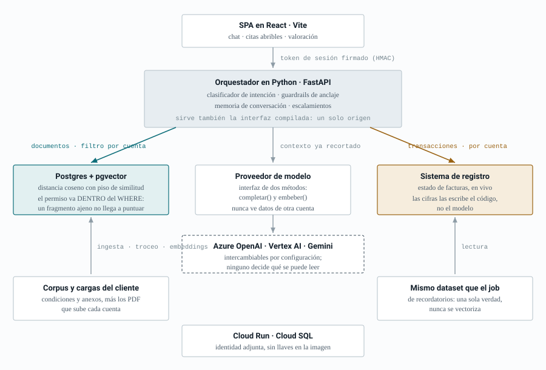
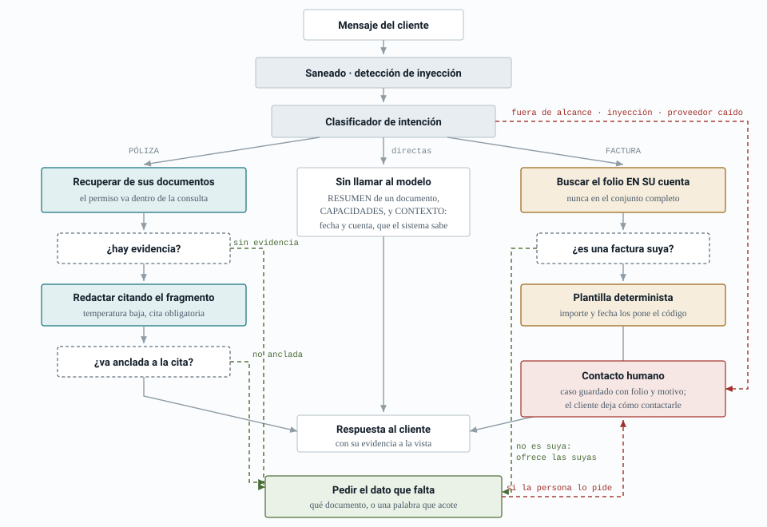
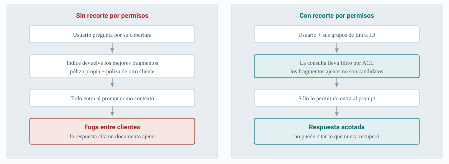

# Asistente interno de pólizas y facturación

Diseño de arquitectura y flujo para un asistente interno de **LeaseMD** que responde dudas frecuentes de pólizas y estado de facturas, con el control de acceso como parte del camino de datos y no como una capa encima.

Comparte dominio con el job de recordatorios de este mismo repositorio: las mismas facturas, el mismo criterio de atraso y el mismo escalamiento a Operaciones. Donde el job **actúa** sin que nadie lo mire, el asistente **responde** a una persona que pregunta — y esa diferencia es la que justifica casi todas las decisiones de abajo.

**Este documento describe un sistema que funciona**, no una propuesta. Hay un prototipo ejecutable en [`asistente/`](../asistente), con 341 pruebas automatizadas, y las afirmaciones sobre comportamiento que siguen están medidas contra él. Donde el diseño y lo construido difieren, lo digo.

---

## Decisión

**Azure OpenAI con RAG, orquestado desde un backend propio en Python (FastAPI) y una SPA en React.** No Copilot Studio, por una razón que va más allá del stack solicitado: las dos intenciones principales necesitan *formas de datos distintas*. Las pólizas son documentos y se resuelven con recuperación semántica; el estado de una factura es un dato transaccional, vivo y con permisos por cliente, que se resuelve llamando al sistema de registro.

Meter facturas en un índice vectorial sería un error de diseño doble: el dato quedaría desactualizado y el índice se convertiría en un canal de fuga entre clientes. **RAG para documentos, consulta directa para transacciones.**

---

## 1. Arquitectura y por qué esta

El requisito de usar Python y React ya descarta un enfoque *low-code*, pero conviene justificar la elección por sus méritos, porque en otro escenario respondería distinto.

| Criterio | Copilot Studio | Azure OpenAI + RAG propio |
|---|---|---|
| Tiempo al primer piloto | Días | Semanas |
| Datos transaccionales con permisos | Conectores genéricos, autorización difícil de auditar | Control total: identidad delegada y autorización en el API |
| Guardrails a medida | Los que trae la plataforma | Umbrales, verificación de anclaje y plantillas propias |
| Evaluación en CI | Limitada | Suite versionada junto al código |
| Costo de mantenimiento | Bajo, sin equipo dedicado | Requiere equipo de desarrollo |

**Elegiría Copilot Studio** si el alcance fuera sólo preguntas sobre documentos, sin consultar importes ni estados por cliente, y si no hubiera equipo de desarrollo para sostenerlo. En cuanto entra un dato por cliente con reglas de acceso, el control fino sobre la autorización deja de ser opcional.

Una tercera vía que sí consideraría en producción: **Copilot Studio como canal en Teams**, llamando por HTTP al mismo backend de Python. Se gana la distribución nativa en Microsoft 365 sin ceder el control del camino de datos.

**Dos formas de datos, dos caminos.** El camino teal recupera documentos y el ámbar consulta transacciones; las respuestas regresan por la misma arista. Lo que el diagrama afirma es que el modelo nunca habla con el sistema de registro: recibe un contexto ya recortado por permisos, y los importes que aparecen en la respuesta los inserta el código, no el modelo.

### El proveedor de modelo es intercambiable, y eso importa

El prototipo corre hoy sobre **Vertex AI**, no sobre Azure OpenAI, por una razón práctica: es la credencial que tenía a mano. Lo digo en vez de omitirlo, y lo relevante es que **no obligó a cambiar nada de la arquitectura**.

El proveedor vive detrás de una interfaz de dos métodos —`completar()` y `embeber()`— con cuatro implementaciones: Azure OpenAI, Vertex AI, Gemini y una falsa para pruebas. Se elige con una variable de entorno. Que un cambio de proveedor sea una línea de configuración no es casualidad: es la consecuencia de no dejar que el modelo decida nada sobre permisos ni sobre cifras. Un componente que solo redacta se sustituye sin ceremonia.

La superficie que se probaría al mover a Azure OpenAI es el piso de similitud, porque el coseno no es una escala universal entre modelos de embedding. Por eso el piso es **por proveedor** y no una constante compartida.

### Componentes y para qué está cada uno

| Componente | Rol | Por qué está |
|---|---|---|
| React + Vite | Interfaz de chat | Renderiza cada cita como un fragmento abrible y captura el pulgar arriba/abajo que alimenta la evaluación |
| FastAPI | Orquestador | Un solo lugar donde viven el ruteo, los guardrails y las consultas: auditable de un vistazo. Sirve además la interfaz compilada, así que en producción hay un único origen |
| Postgres + pgvector | Recuperación | Distancia coseno con piso de similitud. **El permiso va dentro del `WHERE`**, no en una capa posterior |
| Proveedor de modelo | Generación y embeddings | Azure OpenAI, Vertex AI o Gemini, por configuración |
| Postgres | Estado | Documentos, fragmentos, usuarios, conversaciones y escalamientos: una sola base, un solo respaldo |
| Cloud Run + Cloud SQL | Despliegue | Identidad adjunta al servicio; ninguna llave viaja dentro de la imagen |

En producción sobre Azure este mapa cambia poco: Azure AI Search en lugar de pgvector, Entra ID en lugar del acceso local, Key Vault con Managed Identity, y AI Content Safety delante del modelo. La forma —dos caminos, permiso en la consulta, cifras por código— es la misma.

---

## 2. Flujo de las intenciones

El ruteo empieza con un clasificador, y **no clasificar es una respuesta válida**: si la consulta no encaja limpiamente, va al humano en lugar de forzar una rama.

Las tres intenciones que pide el escenario son las que sostienen el diseño. Las otras tres aparecieron al usar el prototipo, y merecen explicación porque **cambian dónde termina una consulta que no se puede responder**.

### Consulta de póliza — documental

*«¿Mi póliza cubre daños por inundación?»*

1. Recuperación sobre el índice, **filtrada por la cuenta del solicitante dentro de la propia consulta**.
2. Si ningún fragmento supera el piso de similitud, no se genera respuesta.
3. Generación con temperatura baja y cita obligatoria de fragmento.
4. Verificación de anclaje: si la respuesta cita algo que no se recuperó, se descarta.

**Límite explícito:** el asistente informa qué dice la póliza, nunca dictamina si un siniestro procede. Esa es una decisión humana y el prompt la rechaza.

### Estado de factura — transaccional

*«¿Ya se pagó la factura de marzo?»*

1. Extracción del folio del mensaje.
2. **Autorización en la consulta**, no en el prompt: se busca el folio dentro de las facturas de esa cuenta, nunca en el conjunto completo.
3. La respuesta se arma con **plantilla determinista**: el modelo eligió la ruta, el código inserta importe, fecha y estado.

**Por qué la plantilla:** un modelo que puede reformular una cifra puede equivocarla. Aquí la exactitud tiene que ser del 100 %, así que se saca del alcance del modelo.

Un folio que no es de la cuenta y uno que no existe **se leen exactamente igual**. Distinguirlos confirmaría la existencia de la factura de otro cliente. Hay una prueba que compara los dos textos carácter a carácter.

### Contacto humano — fallback

Salida cuando algo no se puede sostener **y no hay nada que preguntar**:

- Consulta fuera de alcance: siniestros, contratación, cambios en la póliza, quejas.
- Intento de inyección detectado.
- Proveedor de modelo caído.
- Respuesta del modelo malformada o que cita fragmentos inventados.
- Cuando la persona lo pide, que es una razón tan válida como las otras.

El caso **se guarda**: folio, cuenta, pregunta, motivo y un campo donde el cliente deja cómo prefiere que le contacten. Esto es una corrección sobre el diseño original, y vale la pena decir por qué. La primera versión respondía *«le contactará por este mismo medio»* y no había medio, ni cola, ni registro: el folio se escribía en el log y se tiraba. Era la única promesa sin respaldo en un sistema construido entero alrededor de no afirmar lo que no se puede sostener.

### Lo que el uso añadió: preguntar antes de traspasar

Medido sobre el prototipo, la mayoría de los «no puedo responder» **no eran preguntas que necesitaran una persona**. Eran preguntas a las que les faltaba un dato que quien preguntaba tenía delante:

| Situación | Antes | Ahora |
|---|---|---|
| El modelo no encuentra la respuesta en lo recuperado | Escalamiento con folio | Pide una palabra que acote, o el documento |
| No se sabe qué documento resumir | Escalamiento con folio | Ofrece los suyos para elegir |
| El folio tecleado no es de su cuenta | Escalamiento con folio | Le muestra sus facturas |
| «¿Qué día es hoy?», «gracias» | Escalamiento con folio | Se responde, sin llamar al modelo |
| «¿Qué haces?» | Escalamiento con folio | Lista de capacidades, escrita en el código |

La distinción que hace esto posible es de tipos, no de textos: cuando el modelo responde el centinela `NO_ENCONTRADO` está **portándose bien** —se le pidió no responder sin respaldo y no respondió—, mientras que un JSON roto o una cita inventada es un modelo portándose mal. Antes ambas cosas eran el mismo error y acababan igual.

Lo que **no** cambió es la regla de fondo: sigue sin afirmarse nada que no se pueda sostener con un fragmento. Cambia qué se hace con la negativa. Y la salida humana no desaparece, deja de ser automática: se ofrece como un botón.

La fecha y la lista de capacidades merecen una nota aparte, porque son el mismo principio que los importes de factura llevado a su conclusión: **son datos que el sistema conoce con certeza, así que los escribe el código**. Dejar que el modelo diga la fecha sería pedirle que adivine el calendario. Hay una prueba que usa un proveedor que revienta si se le pide redactar, para que nadie pueda aflojar eso por descuido.

---

## 3. Datos sensibles, PII y gobierno

El riesgo dominante en un asistente con RAG no es que invente: es que **entregue a una persona un documento que no le corresponde**. Si el índice no filtra por permisos, la recuperación se convierte en un canal de exfiltración perfectamente educado.

**La diferencia es una sola arista.** El filtro por permisos en la consulta de recuperación es lo único que separa los dos diseños, y no se puede sustituir con una instrucción en el prompt: al modelo no se le pide que ignore lo que no debe ver, se le impide recibirlo.

| Control | Cómo se aplica | En el prototipo |
|---|---|---|
| **Clasificación primero** | Cada fuente se clasifica antes de indexarla. Condiciones generales y guías son *internas sin PII*; carátulas y anexos son *datos personales*. Las facturas no se indexan: se consultan en vivo | Sí |
| **Recorte en la recuperación** | Cada fragmento lleva su alcance, y el predicado de visibilidad va **dentro de la consulta de ranking**. Un fragmento no permitido no es un candidato descartado: no llega a puntuar | Sí, y probado con dos cuentas |
| **Identidad delegada** | El backend consulta con la identidad del solicitante, no con una cuenta de servicio con permisos totales | Parcial: el prototipo acota por cuenta autenticada; el *on-behalf-of* contra un ERP real queda para producción |
| **Minimización** | Al modelo se le envían los campos que la respuesta necesita, no el objeto completo | Sí |
| **Redacción de PII antes del modelo** | El texto del usuario pasa por detección y se sustituye el dato por su etiqueta, antes de clasificar, de recuperar y de cualquier prompt | Sí, para identificadores con forma: RFC, CURP, tarjeta, CLABE, correo y teléfono. Nombres y direcciones necesitarían reconocimiento de entidades — en Azure, AI Language |
| **Telemetría sin PII** | Trazas con identificadores pseudonimizados y métricas, no texto crudo. Las transcripciones viven aparte, cifradas, con retención corta y auditoría de lectura | Parcial |
| **Aislamiento de la memoria** | Cada conversación pertenece a una cuenta y se comprueba en cada lectura y escritura. Un identificador adivinado no abre la de otro | Sí |
| **Sesiones** | Token firmado con HMAC y expiración dentro del cuerpo firmado. El secreto es obligatorio en producción: sin él cada instancia firmaría distinto y las sesiones se caerían al azar | Sí, y el arranque falla si falta |
| **Contraseñas** | `scrypt` con sal por usuario y comparación en tiempo constante. Correo desconocido y contraseña incorrecta dan el mismo mensaje, para que el formulario no sea un buscador de cuentas | Sí |
| **Secretos** | Ninguna credencial en la imagen. En Cloud Run, identidad adjunta al servicio; en Azure, Key Vault con Managed Identity | Sí |
| **Residencia y no entrenamiento** | Despliegue en región definida, con el compromiso contractual de que los *prompts* no se usan para entrenar. Relevante para la LFPDPPP y para poder responderlo por escrito en una auditoría | Configuración de despliegue |

---

## 4. Guardrails contra alucinación e inyección

### Alucinación

- **Piso de similitud.** La palanca más efectiva y la más simple: si la evidencia recuperada no llega al piso, no se genera respuesta. Es **por proveedor**, porque el coseno no es una escala común entre modelos de embedding.
- **Citas obligatorias y verificables.** Toda afirmación sobre una póliza cita fragmentos, y la interfaz los abre para que el usuario lea el texto exacto que se le pasó al modelo. Una cita que se puede abrir es un guardrail social además de técnico.
- **Las cifras no las escribe el modelo.** Importes, fechas, estatus, la fecha de hoy y la lista de capacidades se insertan por código. El modelo redacta alrededor del dato, nunca lo produce.
- **Verificación de anclaje.** Si la respuesta cita un identificador que no se recuperó —la firma exacta de una respuesta fabricada— se descarta y se escala.
- **Alcance cerrado.** El prompt rechaza dictámenes de cobertura, asesoría legal y cualquier tema fuera de pólizas y facturación.

### Inyección y fuga

- **El documento recuperado es dato, no instrucción.** Separación estricta y etiquetada entre mensaje de sistema, entrada del usuario, transcripción y contexto. Un PDF con texto malicioso incrustado no puede reescribir las reglas.
- **La memoria de conversación vive en el servidor.** Que el cliente mande el historial sería más simple y está mal: un historial que escribe el cliente se puede inventar, y ese texto acaba dentro del prompt. El cliente manda un identificador; qué se dijo lo sabe la base.
- **Detección de intentos de inyección** sobre la entrada, con escalamiento en vez de respuesta. No es una frontera de seguridad —una reescritura decidida pasa cualquier lista— sino un cable trampa que convierte un intento probable en un escalamiento.
- **Los datos personales no llegan al prompt.** Lo que escribe la persona pasa por redacción antes de que lo vea nada: «mi RFC es GME180922K41» viaja como «mi RFC es [RFC]». Se redacta **la entrada, no la documentación recuperada** — los documentos son suyos y un RFC en su propia carátula es justo lo que vino a consultar; redactar la evidencia rompería las respuestas sin proteger a nadie.
- **Cuota y detección de anomalías.** Un usuario que consulta cincuenta folios distintos en cinco minutos no está resolviendo una duda; está sondeando. *Pendiente en el prototipo.*
- **Suite adversaria en CI** con intentos de *jailbreak*, de extracción y de acceso cruzado entre cuentas. Cualquier fallo bloquea el despliegue.

---

## 5. Cómo evaluaría la calidad

Un cambio de prompt es un cambio de código y necesita pruebas de regresión. La base es un **conjunto dorado** de unas 200 preguntas reales tomadas del historial de tickets, etiquetadas por expertos del negocio y balanceadas entre las intenciones.

Lo importante es **medir recuperación y generación por separado**: si la recuperación no trae el fragmento correcto, ningún ajuste de prompt lo arregla, y una métrica agregada esconde exactamente eso.

| Capa | Métrica | Qué diagnostica |
|---|---|---|
| Clasificación | Precisión y exhaustividad por intención | Ruteo. Vigilo sobre todo los casos que *debieron* escalar y no lo hicieron |
| Recuperación | recall@k, MRR, nDCG | Calidad del índice, del troceo y del ranking |
| Generación | Anclaje, relevancia, completitud | Fidelidad al contexto. Juez automático calibrado contra etiquetas humanas |
| Facturación | Exactitud exacta del dato | Tiene que ser 100 %: el dato viene del sistema de registro |
| Seguridad | Bloqueo de la suite adversaria | Compuerta de liberación, no una métrica más |

### Lo que ya se mide en el prototipo

Las **341 pruebas** cubren el ruteo, el aislamiento entre cuentas, el anclaje y los negativos. Las que más valor tienen son las que fijan que dos casos distintos se lean idénticos: una factura ajena y una inexistente, por ejemplo.

La interfaz recoge **pulgar arriba/abajo por respuesta**, y el pulgar abajo abre un campo de texto porque el pulgar solo dice que algo falló, no qué. Es la señal que faltaba: todo el sistema está construido para callarse cuando no tiene evidencia, pero cuando **sí** respondió y se equivocó no queda rastro en ningún log —la respuesta se generó con toda normalidad—. Es el único dato que dice si el piso de similitud está bien puesto.

Dos cosas que la medición ya corrigió, y que ilustran para qué sirve medir:

- Las preguntas sugeridas de la pantalla de bienvenida estaban escritas a mano. Medidas contra el sistema, **tres de seis escalaban** para una cuenta. Ahora se construyen del expediente real y escalan cero.
- La latencia va de 0,9 s a 13,5 s según la ruta. Con una sola animación de puntos, los trece segundos parecen una caída; el servidor emite ahora la etapa en curso conforme ocurre.

### En producción

- **Tasa de resolución sin humano** y tasa de escalamiento, separadas por intención.
- **Proporción de «pedí más datos»**. Si sube, el problema está en el corpus, no en el modelo: son huecos de documentación señalados gratis.
- **Cuántos casos escalados llevan contacto**, que mide si la salida humana sirve de algo o solo cierra la conversación.
- **Clics en las citas**: si nadie abre las fuentes, o no confían o no las necesitan; ambas cosas importan.
- **Revisión humana semanal** de una muestra, priorizando escalamientos y votos negativos. Lo que aparezca ahí se convierte en casos nuevos del conjunto dorado y en documentos nuevos del corpus.

---

## Lo que dejaría fuera del primer alcance

Nada de acciones que escriban: el asistente informa, no cancela pólizas ni aplica pagos. Habilitar escritura cambia el perfil de riesgo por completo y exige confirmación explícita, idempotencia y bitácora de auditoría, igual que el *job* de recordatorios de este mismo repositorio.

Tampoco arrancaría con voz ni con múltiples idiomas, y mediría el costo por conversación desde el primer día: es la variable que decide si el piloto puede crecer.

De lo que hoy falta en el prototipo, lo que pondría primero es el **reconocimiento de entidades** para completar la redacción de PII. La que hay acierta con los identificadores que tienen forma —RFC, CURP, tarjeta, CLABE, correo, teléfono— porque se pueden reconocer sin un modelo; un nombre o una dirección no. En Azure sería AI Language, delante del mismo punto donde hoy corre la redacción por patrones.

Y una nota de operación que se ve en cuanto se despliega: **la redacción protege lo que entra a partir de ahora**. Las conversaciones guardadas antes de activarla conservan lo que se escribió entonces, así que encenderla en un sistema con historial exige además una pasada de limpieza o una política de retención corta. No es un detalle: es la diferencia entre proteger los datos y creer que están protegidos.
